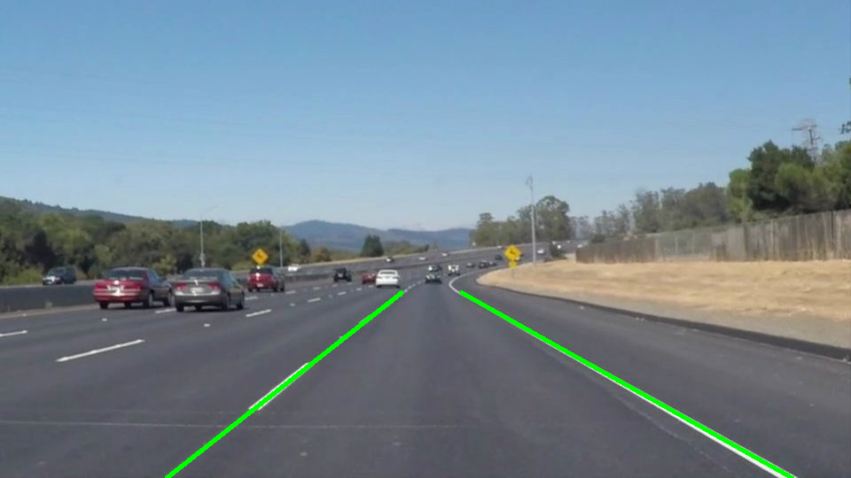
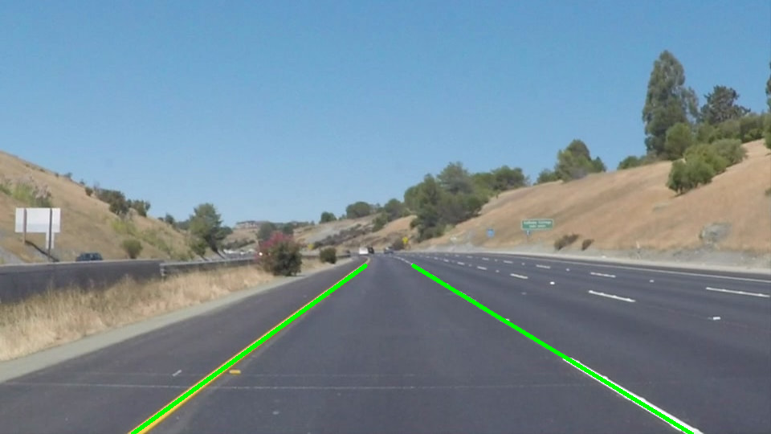

# SDC-basic-lane-detection
The goal of this project is to detect lane lines in an image generated by the center camera of a car. These sequence of images are then stitched together to detect lane lines in a video. Image processing routines such as converting to grayscale, edge detection and hough tranforms are used to detect the lane lines. 

Key steps in this pipeline are:
* Applying color transform to better detect white and yellow lanes
* Converting RGB image to grayscale
* Applying canny edge detection to detect edges in the image
* Windowing the image to retain the area of interest
* Applying hough transform to get lane lines
* Processing lines from the hough transform and curve fitting to identify lane lines
* Running the entire pipeline on a video  

---
### Code

The python notebook `lane_detection_basic.ipynb` implements the pipeline and runs the pipeline on test images and video. Implementation consists of the following files located in this directory

* lane_detection_basic.ipynb        -   Implement the pipeline   
* out_images                        -   Folder with outputs from running the pipeline on test images
* out_videos                        -   Folder with lane detection on the two videos with white and yellow lanes 
* writeup.md                        -   You are reading it

### Pipeline description

As mentioned above, the pipeline consits the following steps implemented in 'lane_detection_basic.ipynb'. The entire pipeline is show below

```python
    #Image pipeline 
    def image_pipeline(image, canny_thresh, vertices):  
        mask_img = colormask_yellowwhite(image)
        img_grayscale = convert_to_gscale(mask_img)
        blur_img = apply_gaussblur(img_grayscale)
        img_canny = apply_canny(blur_img,canny_thresh)
        img_bounded = region_of_interest(img_canny, vertices)
        lines = apply_hough(img_bounded)
        filled_image = draw_lines(image, lines)
        return filled_image
```

1. The first step in the pipeline is processing the RGB image through a color mask so that only yellows and whites are detected. This is implemented as shown below. Two copies of the source image are made - one copy is run through a white color mask, and the other through an yellow color mask. The threshold values for both color masks are obtained from a few experiments. Finally both the masks are combined using 'cv2.addweighted()' function.

```python
    def colormask_yellowwhite(image):
    
        # Add yellow color mask and white mask to better detect the lanes
        # White horizontal marker lanes seems to introduce errors int the pipeline 
        
        #contains actual image on the left    
        image_left = np.copy(image)
        image_rt = np.copy(image)
    
        #Look for white pixels
        white_threshold = 200
        lower_white = np.array([200, 200, 200])
        upper_white = np.array([255, 255, 255])
        white_mask = cv2.inRange(image_rt, lower_white, upper_white)
        white_image = cv2.bitwise_and(image_rt, image_rt, mask=white_mask)
    
        # Look for yellow pixels
        hsv = cv2.cvtColor(image_left, cv2.COLOR_BGR2HSV)
        low_yellow = np.array([90,100,100])
        up_yellow = np.array([110,255,255])
        
        yellow_mask = cv2.inRange(hsv, low_yellow, up_yellow)
        yellow_image = cv2.bitwise_and(image_left, image_left, mask=yellow_mask)
  
        # Combine the two above images
        image_clrmasked = cv2.addWeighted(white_image, 1., yellow_image, 1., 0.)
    
        return image_clrmasked
```

2. The next step of the pipeline is to convert the masked image generated above into gray scale. Gaussian blur is then applied to the gray scale image as shown below. 

```python
    def apply_gaussblur(image, kernel_size = 3):
        img_blur = cv2.GaussianBlur(image, (kernel_size, kernel_size), 0)
        return img_blur
 
    def convert_to_gscale(image):
        img_grayscale = cv2.cvtColor(image,cv2.COLOR_RGB2GRAY) 
        return img_grayscale
```    

3. Then the image is sent through to a canny detector to detect edges. The underlying operation is gradient detection on intensity values of the image. THe thresholds on canny were determined again by experimentation to ensure that most of the lanes were detected.

```python
    def apply_canny(image,thresh =(125,200)):
        img_canny = cv2.Canny(image,thresh[0],thresh[1])
        return img_canny
```

4. The next step is to apply a window that only keep the area of interest and masks the rest of the image. This is implemented in the function 'region_of_interest()' 

5. Hough transform is then applied on the windowed image to convert it into hough space and identify the lines. This is implemented using the `cv2.HoughLineP()` function shown below

```python
    def apply_hough(image):  
        lines = cv2.HoughLinesP(image, 2, np.pi/180, 15, np.array([]), 10, 20)
        return lines
```

6. The lines from hough transform are then processed and curve fitted to identify lanes lines in the function `draw_lines()`. First the lines are checked to remove horizontal and vertical lines. Then the x_coordinates are compared to the center of the image to classify them as left or right lanes. A additional threshold on the slope of the image is applied to eliminate error cases. The resulting left and right arrays are then curve fitted to obtain a linear function for lanes. The actual lines are then calculated from the linear coefficients (y = mx + b => x = (y - m)/b) and x-coordinates for the bottom portion of the image. Once the end points of the lane lines are calulated, the line is superimposed on the image using the function `cv2.line()`

```python
    def draw_lines(image, lines, color=[0, 255, 0], thickness=3):
            
        img_copy = np.copy(image)
        x_center = (np.rint(image.shape[1]/2)).astype(int)
                
        leftfit_xarr = []
        leftfit_yarr = []
        rightfit_xarr = []
        rightfit_yarr = []
    
        slope_thresh1 = -0.5
        slope_thresh2 = 0.5
    
        for line in lines:
            for x1,y1,x2,y2 in line:
                #few error correction cases - eliminate slope of 0 or infinity
                if ((x1 == x2) or (y1 == y2)):
                    break;  
            
                #check slope and classify them as left and right lines
                slope = (y2-y1)/(x2-x1);
            
                if ((x1 < x_center) and (x2 < x_center) and (slope < slope_thresh1) ):
                    leftfit_xarr = np.append(leftfit_xarr, x1)
                    leftfit_yarr = np.append(leftfit_yarr,y1)
                    leftfit_xarr = np.append(leftfit_xarr, x2)
                    leftfit_yarr = np.append(leftfit_yarr,y2)
                                
                elif ((x1 > x_center) and (x2 > x_center) and (slope > slope_thresh2)):
                    rightfit_xarr = np.append(rightfit_xarr, x1)
                    rightfit_yarr = np.append(rightfit_yarr,y1)
                    rightfit_xarr = np.append(rightfit_xarr, x2)
                    rightfit_yarr = np.append(rightfit_yarr,y2)

        #fit the x and y lane coordinates collected 
        fitleft_m, fitleft_c = np.polyfit(leftfit_xarr, leftfit_yarr, 1)
        fitright_m, fitright_c = np.polyfit(rightfit_xarr, rightfit_yarr, 1)
    
        #define the ycorodinates where the linear fit will be evaluated
        y_vals_max = img_copy.shape[0]
        y_vals_min = img_copy.shape[0] - 210
    
        #calculate x values of left and right lanes from the linear fit
        x_vals_lft_min = ((y_vals_min - fitleft_c)/fitleft_m).astype(int)
        x_vals_lft_max = ((y_vals_max - fitleft_c)/fitleft_m).astype(int)
    
        x_vals_rt_min = ((y_vals_min - fitright_c)/fitright_m).astype(int)
        x_vals_rt_max = ((y_vals_max - fitright_c)/fitright_m).astype(int)
    
        #draw the line on the source image
        cv2.line(image, (x_vals_lft_min, y_vals_min), (x_vals_lft_max, y_vals_max), color, thickness)
        cv2.line(image, (x_vals_rt_min, y_vals_min), (x_vals_rt_max, y_vals_max), color, thickness)
     
        return image
```

Here are a few images with the detected lane lines.





### Potential Shortcomings

There are many shortcomings of this simple lane detection model. First curvature of lanes are not detected and the simple linear fit does not capture the lanes in the real world. Second, imperfections in the lanes are not accounted for - differnt lighting and surface conditions are not accounted for. Even if the lane is missing for a very small distance on the road, the algorithm currently does not do any extrapolation/prediction.    

### Potential improvements

One potential improvement can be using a polyfit with higher orders to track lines that are curved. Additional improvements on color processing can be implemented to ensure that the road is detected under different light and shadow conditions.
